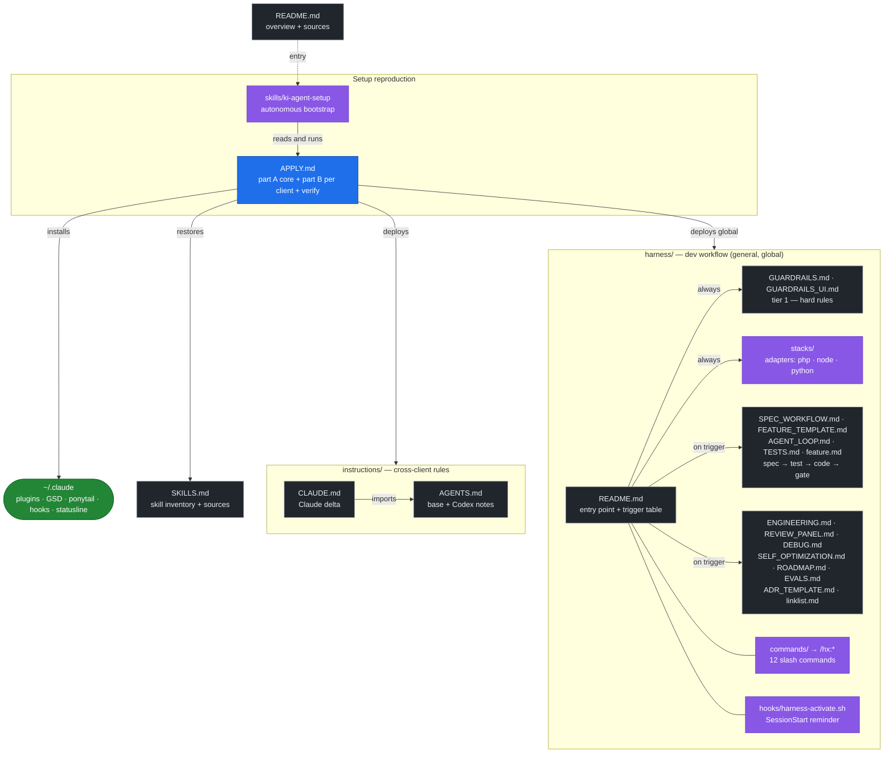

# ki-agent-setup

[🇩🇪 Deutsch](README.md) | 🇬🇧 English

Portable description of my local AI agent setup — cross-client (Claude Code,
Codex, Cursor, Gemini …), with Claude Code as the primary client.

Goal: check out this repo on a new machine, tell the AI client *"read `APPLY.md`
and apply it"* — and the setup is reproduced. Define once, sync everywhere,
update and adapt easily.

This repo contains **no machine-local runtime config files**; it contains docs,
templates, and verification helpers. The AI client builds the concrete
configuration itself from [`APPLY.md`](APPLY.md).

---

## Usage

```bash
git clone git@github.com:derivo/ki-agent-setup.git
```

Then in the AI client:

> Read `APPLY.md` and apply the setup to this machine.

Or use the autonomous bootstrap skill
([`skills/ki-agent-setup/SKILL.md`](skills/ki-agent-setup/SKILL.md)) — it
orchestrates the whole setup from `APPLY.md` on its own. Make it available once:

```bash
ln -s "$(pwd)/skills/ki-agent-setup" ~/.claude/skills/ki-agent-setup
```

Change the setup → edit `APPLY.md`, commit, pull on other machines.

Before committing:

```bash
make verify-docs
```

---

## What the setup does

The setup turns an AI coding client into a structured development agent. It has
two layers:

**Cross-client** — applies to any agent (Claude Code, Codex, Cursor, Gemini …):
- Layered working rules following the [AGENTS.md](https://agents.md) standard
  ([`instructions/`](instructions/)): shared base (`AGENTS.md`) + thin client
  additions (Claude in `CLAUDE.md`, Codex clearly marked in `AGENTS.md`) —
  German output, think-before-coding, simplicity-first, surgical changes,
  honesty/verification discipline, mandatory edge-case testing.
- [`harness/`](harness/README.md) — general, stack-agnostic software-development
  workflow (spec → test → code → gate, self-optimization) plus its command
  library ([`harness/commands/`](harness/commands/README.md), 12 commands):
  namespaced as `/hx:start`, `/hx:spec`, `/hx:review` … in Claude Code, as
  `$hx-*` skills in Codex.
- [`doc-harness/`](doc-harness/README.md) — workflow for documentation projects.
- **GSD (get-shit-done)** — phase/roadmap workflow, single source of truth; the
  installer supports multiple runtimes.
- **Skills** — installable cross-client via the `skills` CLI
  ([`SKILLS.md`](SKILLS.md)).

**Claude-Code-specific** — the plumbing that wires it into Claude Code:
- **ponytail** — solution minimalism (YAGNI ladder, stdlib/native before a new
  dependency); the active mode.
- **caveman** — token-compressed communication; installed but set to
  `defaultMode: off`.
- **codex** — drive the Codex CLI from Claude Code: review, adversarial review,
  delegation (`/codex:*`).
- **Statusline** (`gsd-statusline.js`), **hooks**, and `settings.json` — native
  Claude Code mechanisms.

Accordingly, [`APPLY.md`](APPLY.md) has two parts: part A describes the shared
core, part B describes per client where that substance goes and which
client-specific plumbing comes with it (B1 `~/.claude/`, B2 `~/.codex/`,
B3 `~/.gemini/`, B4 `~/.config/opencode/`). Claude Code is the primary target.

---

## Installed extensions

| Tool | Source | Type | Purpose |
|---|---|---|---|
| **GSD (get-shit-done)** | own installer → runtime-specific (`~/.claude/get-shit-done`, `~/.codex/get-shit-done`, …) | hooks + skills + commands + statusline | phase/roadmap workflow, state tracking, commit guards |
| **ponytail** | `DietrichGebert/ponytail` | plugin (marketplace) | solution minimalism, levels lite/full/ultra — **active** |
| **caveman** | `JuliusBrussee/caveman` | plugin (marketplace) | token-compressed communication, levels lite/full/ultra — installed but off |
| **codex** | `openai/codex-plugin-cc` | plugin (marketplace) | Codex CLI from Claude Code: review, adversarial review, delegation |

Details on versions, hooks, and settings: see [`APPLY.md`](APPLY.md).

**Not part of the reproducible setup:** plugins from a local directory
marketplace rather than GitHub (currently `thebrain`). They depend on
machine-local paths and cannot be restored from this repo — `claude plugin list`
shows them, `APPLY.md` does not install them.

### Additional skills (not from GSD or the plugins)

Separately installed skills (web, testing, PHP, security …), managed by a skill
manager with the lockfile `~/.agents/.skill-lock.json`. Full inventory with the
GitHub source per skill: [`SKILLS.md`](SKILLS.md).

### MCP servers & security

- **MCP servers** — curated, security-conscious recommendations (context7, GitHub,
  Playwright …): [`MCP_SERVERS.md`](MCP_SERVERS.md). The core set is installed as
  part of the setup (`APPLY.md` A4); the file doubles as the secret-free
  inventory.
- **Security** — hardening layer around the agent (secret scanning, tool block
  hook, logging proxy, egress, supply chain, sandbox, prompt injection):
  [`security/`](security/README.md). The base controls (secret scan, tool guard)
  are part of the setup (`APPLY.md` A6).

---

## Statusline layout

Custom statusline via `~/.claude/hooks/gsd-statusline.js` (GSD 1.11, single line).
Layout (target structure, derived from the renderer):

```
[GSD update warning] model │ task or GSD state │ dirname [│ git + markers] [context meter] [│ last: /command]
```

Example:
```
Opus 5 (1M) │ v0.2.0 auth · Phase 3 executing │ myproject │ main✓ [▰▰▰▰▰▰░░░░] 62%
```

Properties:
- One line; model and dirname are dimmed. The context meter sits at the end by
  default (`statusline.context_position: front|end` moves it).
- Middle: the current todo task (bold) or the GSD state — milestone version +
  name + phase/status; reads `.planning/STATE.md` + `.planning/config.json`
  walking up the hierarchy. Compact format (`statusline.state_format: compact`)
  and the milestone progress bar are opt-in.
- Context meter: buffer-aware against the auto-compact reserve (~16.5%,
  overridable via `CLAUDE_CODE_AUTO_COMPACT_WINDOW`); color steps at 50/65/80%,
  💀 above 80%. Writes the values to the bridge file used by the
  `gsd-context-monitor` hook. Absolute token count is opt-in
  (`statusline.show_context_tokens`).
- Git segment opt-in (`statusline.show_git`): branch plus work markers
  (`+`staged `~`unstaged `?`untracked `↑`ahead `↓`behind, `✓` clean) from
  `git status --porcelain=v2`.
- `last: /command` suffix opt-in (`statusline.show_last_command`). All options
  live under `statusline.*` in the project's `.planning/config.json`.
- Compared to the old edition, gone: multi-line layout, cached-token counter,
  5h/weekly limits and session cost — the 1.11 renderer no longer has them.
- Fails silently on any error — never breaks the statusline.
- The bottom terminal line (`bypass permissions on …`) is **Claude Code native**,
  not part of this script.

---

## How the files work together



`APPLY.md` is the hub: the bootstrap skill reads it, it deploys the
`instructions/` **and** the [`harness/`](harness/README.md) globally into the
client config directories (`~/.claude/`, `~/.codex/`, `~/.gemini/`), installs the
tools, and restores the skills. The `harness/` is the
**general** software-development workflow (stack-agnostic); concrete stack details
live as adapters under `harness/stacks/` (e.g.
[`stacks/php`](harness/stacks/php/README.md) for PHP web + DB). Alongside it,
[`doc-harness/`](doc-harness/README.md) is the workflow for **documentation**
projects. Codex uses `~/.codex/AGENTS.md` and the harness mirror under
`~/.codex/harness/`; harness workflows are installed as `$hx-*` skills under
`~/.agents/skills/`. This setup does not use a separate `CODEX.md`.

For repo maintenance, there is a no-dependency baseline check:
[`scripts/verify-docs.py`](scripts/verify-docs.py), exposed as
`make verify-docs`. It checks internal Markdown links, `git diff --check`, and
basic secret patterns plus the Codex skill deploy and its sync check; external
URL provenance remains a per-session duty under `instructions/AGENTS.md`.

---

## Sources

### Tools & plugins
- GSD (get-shit-done): https://github.com/open-gsd/gsd-core — npm `@opengsd/gsd-core`, install pin in `APPLY.md` (predecessor `gsd-build/get-shit-done` archived)
- ponytail: https://github.com/DietrichGebert/ponytail
- caveman: https://github.com/JuliusBrussee/caveman
- codex (Claude Code plugin): https://github.com/openai/codex-plugin-cc
- Anthropic Skills (webapp-testing): https://github.com/anthropics/skills

### Skill sources (see `SKILLS.md`)
- **skills.sh** — skill registry & CLI (`npx skills add <owner/repo>`): https://skills.sh
- Skill manager / `find-skills` skill: https://github.com/vercel-labs/skills
- Web Quality (web-quality-audit, accessibility, performance): https://github.com/addyosmani/web-quality-skills
- Web Design Guidelines: https://github.com/vercel-labs/agent-skills
- UI/UX Pro Max: https://github.com/nextlevelbuilder/ui-ux-pro-max-skill
- Dev Essentials (e2e-testing, code-review): https://github.com/wshobson/agents
- Agentic QE (compatibility-, chaos-testing): https://github.com/proffesor-for-testing/agentic-qe
- browser-use: https://github.com/browser-use/browser-use
- Remotion: https://github.com/remotion-dev/skills
- Ecommerce SEO: https://github.com/affilino/ecommerce-seo-audit-skill

### Standards / reference
- **AGENTS.md** — cross-client instruction standard (Linux Foundation / Agentic AI Foundation): https://agents.md
- Claude Code docs: https://docs.claude.com/en/docs/claude-code
- Claude Code memory (CLAUDE.md, imports): https://docs.claude.com/en/docs/claude-code/memory
- Agent Skills (Anthropic): https://docs.claude.com/en/docs/claude-code/skills
- Andrej Karpathy — guidelines (LLM coding pitfalls): https://github.com/multica-ai/andrej-karpathy-skills
  · original tweet: https://x.com/karpathy/status/2015883857489522876
