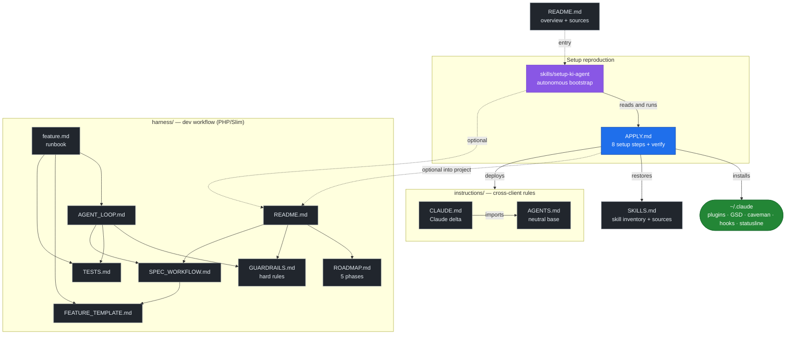

# ki-agents

[🇩🇪 Deutsch](README.md) | 🇬🇧 English

Portable description of my local AI agent setup (Claude Code).

Goal: check out this repo on a new machine, tell the AI client *"read `APPLY.md`
and apply it"* — and the setup is reproduced. Define once, sync everywhere,
update and adapt easily.

This repo contains **no** config files, only documentation. The AI client builds
the configuration itself from [`APPLY.md`](APPLY.md).

---

## How the files work together



`APPLY.md` is the hub: the bootstrap skill reads it, it deploys the
`instructions/`, installs the tools into `~/.claude`, and restores the skills.
Independent of that are two optional, project-scoped documentation sets that get
copied into a target project on demand: [`harness/`](harness/README.md) (workflow
for **code** projects, PHP/Slim) and [`doc-harness/`](doc-harness/README.md)
(workflow for **documentation** projects).

---

## What the setup does

Claude Code is extended into a structured development agent:

- **GSD (get-shit-done)** as single source of truth for project work
  (phases, roadmap, state tracking, atomic commits).
- **caveman** compresses communication (~75 % fewer tokens).
- Global working rules, layered cross-client ([`instructions/`](instructions/)):
  neutral base (`AGENTS.md`) + Claude delta (`CLAUDE.md`) — German output,
  think-before-coding, simplicity-first, surgical changes, mandatory edge-case
  testing.

---

## Statusline layout

Custom statusline via `~/.claude/hooks/gsd-statusline.js` (GSD Edition).
Layout, top to bottom (target structure, aligned with the real output):

```
[GSD update warning]                                       (optional, only on update/stale hooks)
model (context window) │ [context meter] <used>%  │  <N> cached
[5h limit] <used>% - HH:MM  │  [weekly limit] <used>% - day HH:MM  │  $<session cost>
full path │ git branch                                     (dim)
<GSD version> [milestone bar] <used>% · <GSD state/phase> │ dirname  [│ last: /command]
```

Example (project `grouphero`):
```
Opus 4.8 (1M context)  [▰▰▰▰▰▰░░░░] 62%   520.0k cached
[▰▰▰▰▰▰▰▰░░] 80% - 23:50  │  [▰▰▰▰░░░░░░] 42% - Tue 21:00  │  $225
/Users/dennis/code/grouphero │ main
v0.1.0 [▰▰▰▰▰▰▰░░░] 71% · executing │ grouphero
```

Properties:
- Row 1: model + context meter (used share, color-coded) + cached tokens.
- Row 2: 5-hour rate limit and weekly limit (each `used% - reset`) + session cost in `$`.
- Row 3: full path + git branch (directly from `.git/HEAD`, no subprocess, worktree-aware).
- Row 4: GSD milestone version + progress bar + GSD state/phase + dirname; reads
  `.planning/STATE.md` + `.planning/config.json` walking up the hierarchy.
  Optional `last: /command` suffix when enabled in config.
- Fails silently on any error — never breaks the statusline.
- The bottom terminal line (`bypass permissions on …`) is **Claude Code native**,
  not part of this script.

---

## Installed tools

| Tool | Source | Type | Purpose |
|---|---|---|---|
| **GSD (get-shit-done)** | own installer → `~/.claude/get-shit-done` | hooks + skills + commands + statusline | phase/roadmap workflow, state tracking, commit guards |
| **caveman** | `JuliusBrussee/caveman` | plugin (marketplace) | token-compressed communication, levels lite/full/ultra |

Details on versions, hooks, and settings: see [`APPLY.md`](APPLY.md).

### Additional skills (not from GSD/caveman)

Separately installed skills (web, testing, PHP, security …), managed by a skill
manager with the lockfile `~/.agents/.skill-lock.json`. Full inventory with the
GitHub source per skill: [`SKILLS.md`](SKILLS.md).

---

## Usage

```bash
git clone git@github.com:derivo/ki-agents-parts.git
```

Then in the AI client:

> Read `APPLY.md` and apply the setup to this machine.

Or use the autonomous bootstrap skill
([`skills/setup-ki-agent/SKILL.md`](skills/setup-ki-agent/SKILL.md)) — it
orchestrates the whole setup from `APPLY.md` on its own. Make it available once:

```bash
ln -s "$(pwd)/skills/setup-ki-agent" ~/.claude/skills/setup-ki-agent
```

Change the setup → edit `APPLY.md`, commit, pull on other machines.

---

## Sources

### Tools & plugins
- GSD (get-shit-done): https://github.com/open-gsd/gsd-core — npm `@opengsd/gsd-core`, install `npx @opengsd/gsd-core@latest` (predecessor `gsd-build/get-shit-done` archived)
- caveman: https://github.com/JuliusBrussee/caveman
- Anthropic Skills (webapp-testing): https://github.com/anthropics/skills

### Skill sources (see `SKILLS.md`)
- **skills.sh** — skill registry & CLI (`npx skills add <owner/repo>`): https://skills.sh
- Skill manager / `find-skills` skill: https://github.com/vercel-labs/skills
- Web Quality (web-quality-audit, accessibility, performance): https://github.com/addyosmani/web-quality-skills
- Web Design Guidelines: https://github.com/vercel-labs/agent-skills
- UI/UX Pro Max: https://github.com/nextlevelbuilder/ui-ux-pro-max-skill
- Dev Essentials (e2e-testing, code-review): https://github.com/wshobson/agents
- Agentic QE (compatibility-, chaos-testing): https://github.com/proffesor-for-testing/agentic-qe
- browser-use: https://github.com/browser-use/browser-use
- Remotion: https://github.com/remotion-dev/skills
- Ecommerce SEO: https://github.com/affilino/ecommerce-seo-audit-skill

### Standards / reference
- **AGENTS.md** — cross-client instruction standard (Linux Foundation / Agentic AI Foundation): https://agents.md
- Claude Code docs: https://docs.claude.com/en/docs/claude-code
- Claude Code memory (CLAUDE.md, imports): https://docs.claude.com/en/docs/claude-code/memory
- Agent Skills (Anthropic): https://docs.claude.com/en/docs/claude-code/skills
- Andrej Karpathy — guidelines (LLM coding pitfalls): https://github.com/multica-ai/andrej-karpathy-skills
  · original tweet: https://x.com/karpathy/status/2015883857489522876
