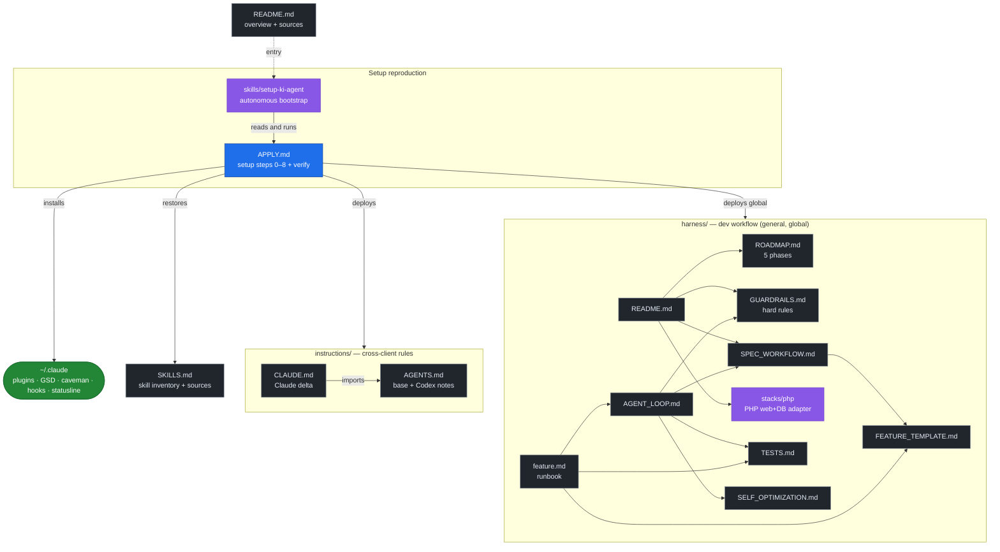

# ki-agents

[🇩🇪 Deutsch](README.md) | 🇬🇧 English

Portable description of my local AI agent setup — cross-client (Claude Code,
Codex, Cursor, Gemini …), with Claude Code as the primary client.

Goal: check out this repo on a new machine, tell the AI client *"read `APPLY.md`
and apply it"* — and the setup is reproduced. Define once, sync everywhere,
update and adapt easily.

This repo contains **no machine-local runtime config files**; it contains docs,
templates, and verification helpers. The AI client builds the concrete
configuration itself from [`APPLY.md`](APPLY.md).

---

## Usage

```bash
git clone git@github.com:derivo/ki-agent-setup.git
```

Then in the AI client:

> Read `APPLY.md` and apply the setup to this machine.

Or use the autonomous bootstrap skill
([`skills/setup-ki-agent/SKILL.md`](skills/setup-ki-agent/SKILL.md)) — it
orchestrates the whole setup from `APPLY.md` on its own. Make it available once:

```bash
ln -s "$(pwd)/skills/setup-ki-agent" ~/.claude/skills/setup-ki-agent
```

Change the setup → edit `APPLY.md`, commit, pull on other machines.

Before committing:

```bash
make verify-docs
```

---

## What the setup does

The setup turns an AI coding client into a structured development agent. It has
two layers:

**Cross-client** — applies to any agent (Claude Code, Codex, Cursor, Gemini …):
- Layered working rules following the [AGENTS.md](https://agents.md) standard
  ([`instructions/`](instructions/)): shared base (`AGENTS.md`) + thin client
  additions (Claude in `CLAUDE.md`, Codex clearly marked in `AGENTS.md`) —
  German output, think-before-coding, simplicity-first, surgical changes,
  honesty/verification discipline, mandatory edge-case testing.
- [`harness/`](harness/README.md) — general, stack-agnostic software-development
  workflow (spec → test → code → gate, self-optimization).
- [`doc-harness/`](doc-harness/README.md) — workflow for documentation projects.
- **GSD (get-shit-done)** — phase/roadmap workflow, single source of truth; the
  installer supports multiple runtimes.
- **Skills** — installable cross-client via the `skills` CLI
  ([`SKILLS.md`](SKILLS.md)).

**Claude-Code-specific** — the plumbing that wires it into Claude Code:
- **caveman** — token-compressed communication (~75 % fewer tokens).
- **Statusline** (`gsd-statusline.js`), **hooks**, and `settings.json` — native
  Claude Code mechanisms.

Accordingly, [`APPLY.md`](APPLY.md) is primarily tailored to Claude Code
(`claude plugin …`, `~/.claude/`); the cross-client layer is additionally rolled
out to other clients (step 7 → `~/.codex/`, `~/.gemini/` …).

---

## Installed extensions

| Tool | Source | Type | Purpose |
|---|---|---|---|
| **GSD (get-shit-done)** | own installer → runtime-specific (`~/.claude/get-shit-done`, `~/.codex/get-shit-done`, …) | hooks + skills + commands + statusline | phase/roadmap workflow, state tracking, commit guards |
| **caveman** | `JuliusBrussee/caveman` | plugin (marketplace) | token-compressed communication, levels lite/full/ultra |

Details on versions, hooks, and settings: see [`APPLY.md`](APPLY.md).

### Additional skills (not from GSD/caveman)

Separately installed skills (web, testing, PHP, security …), managed by a skill
manager with the lockfile `~/.agents/.skill-lock.json`. Full inventory with the
GitHub source per skill: [`SKILLS.md`](SKILLS.md).

### MCP servers & security

- **MCP servers** — curated, security-conscious recommendations (context7, GitHub,
  Playwright …): [`MCP_SERVERS.md`](MCP_SERVERS.md). The core set is installed as
  part of the setup (`APPLY.md` step 7d); the file doubles as the secret-free
  inventory.
- **Security** — hardening layer around the agent (secret scanning, tool block
  hook, logging proxy, egress, supply chain, sandbox, prompt injection):
  [`security/`](security/README.md). The base controls (secret scan, tool guard)
  are part of the setup (`APPLY.md` step 7e).

---

## Statusline layout

Custom statusline via `~/.claude/hooks/gsd-statusline.js` (GSD Edition).
Layout, top to bottom (target structure, aligned with the real output):

```
[GSD update warning]                                       (optional, only on update/stale hooks)
model (context window) │ [context meter] <used>%  │  <N> cached
[5h limit] <used>% - HH:MM  │  [weekly limit] <used>% - day HH:MM  │  $<session cost>
full path │ git branch                                     (dim)
<GSD version> [milestone bar] <used>% · <GSD state/phase> │ dirname  [│ last: /command]
```

Example:
```
Opus 4.8 (1M context)  [▰▰▰▰▰▰░░░░] 62%   520.0k cached
[▰▰▰▰▰▰▰▰░░] 80% - 23:50  │  [▰▰▰▰░░░░░░] 42% - Tue 21:00  │  $225
/Users/you/code/myproject │ main
v0.1.0 [▰▰▰▰▰▰▰░░░] 71% · executing │ myproject
```

Properties:
- Row 1: model + context meter (used share, color-coded) + cached tokens.
- Row 2: 5-hour rate limit and weekly limit (each `used% - reset`) + session cost in `$`.
- Row 3: full path + git branch (directly from `.git/HEAD`, no subprocess, worktree-aware).
- Row 4: GSD milestone version + progress bar + GSD state/phase + dirname; reads
  `.planning/STATE.md` + `.planning/config.json` walking up the hierarchy.
  Optional `last: /command` suffix when enabled in config.
- Fails silently on any error — never breaks the statusline.
- The bottom terminal line (`bypass permissions on …`) is **Claude Code native**,
  not part of this script.

---

## How the files work together



`APPLY.md` is the hub: the bootstrap skill reads it, it deploys the
`instructions/` **and** the [`harness/`](harness/README.md) globally into the
client config directories (`~/.claude/`, `~/.codex/`, `~/.gemini/`), installs the
tools, and restores the skills. The `harness/` is the
**general** software-development workflow (stack-agnostic); concrete stack details
live as adapters under `harness/stacks/` (e.g.
[`stacks/php`](harness/stacks/php/README.md) for PHP web + DB). Alongside it,
[`doc-harness/`](doc-harness/README.md) is the workflow for **documentation**
projects. Codex uses `~/.codex/AGENTS.md` and the harness mirror under
`~/.codex/harness/`; this setup does not use a separate `CODEX.md`.

For repo maintenance, there is a no-dependency baseline check:
[`scripts/verify-docs.py`](scripts/verify-docs.py), exposed as
`make verify-docs`. It checks internal Markdown links, `git diff --check`, and
basic secret patterns; external URL provenance remains a per-session duty under
`instructions/AGENTS.md`.

---

## Sources

### Tools & plugins
- GSD (get-shit-done): https://github.com/open-gsd/gsd-core — npm `@opengsd/gsd-core`, install pin in `APPLY.md` (predecessor `gsd-build/get-shit-done` archived)
- caveman: https://github.com/JuliusBrussee/caveman
- Anthropic Skills (webapp-testing): https://github.com/anthropics/skills

### Skill sources (see `SKILLS.md`)
- **skills.sh** — skill registry & CLI (`npx skills add <owner/repo>`): https://skills.sh
- Skill manager / `find-skills` skill: https://github.com/vercel-labs/skills
- Web Quality (web-quality-audit, accessibility, performance): https://github.com/addyosmani/web-quality-skills
- Web Design Guidelines: https://github.com/vercel-labs/agent-skills
- UI/UX Pro Max: https://github.com/nextlevelbuilder/ui-ux-pro-max-skill
- Dev Essentials (e2e-testing, code-review): https://github.com/wshobson/agents
- Agentic QE (compatibility-, chaos-testing): https://github.com/proffesor-for-testing/agentic-qe
- browser-use: https://github.com/browser-use/browser-use
- Remotion: https://github.com/remotion-dev/skills
- Ecommerce SEO: https://github.com/affilino/ecommerce-seo-audit-skill

### Standards / reference
- **AGENTS.md** — cross-client instruction standard (Linux Foundation / Agentic AI Foundation): https://agents.md
- Claude Code docs: https://docs.claude.com/en/docs/claude-code
- Claude Code memory (CLAUDE.md, imports): https://docs.claude.com/en/docs/claude-code/memory
- Agent Skills (Anthropic): https://docs.claude.com/en/docs/claude-code/skills
- Andrej Karpathy — guidelines (LLM coding pitfalls): https://github.com/multica-ai/andrej-karpathy-skills
  · original tweet: https://x.com/karpathy/status/2015883857489522876
