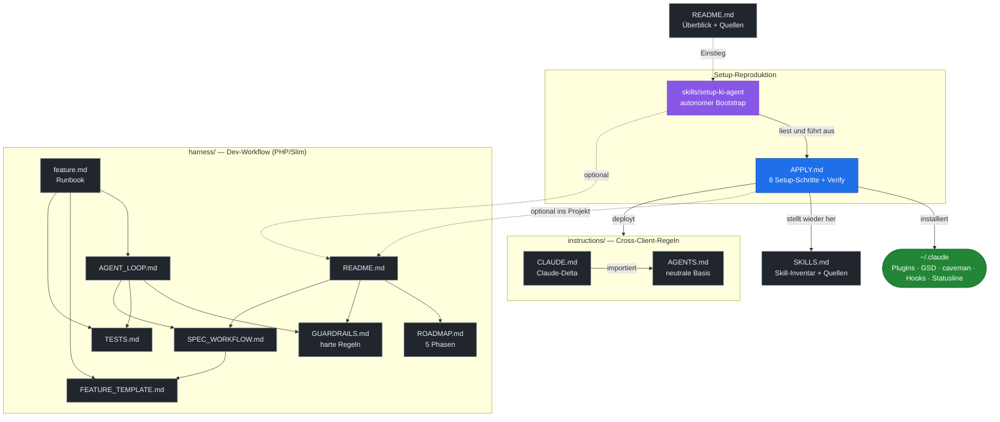

# ki-agents

🇩🇪 Deutsch | [🇬🇧 English](README.en.md)

Portable Beschreibung meines lokalen KI-Agent-Setups (Claude Code).

Ziel: Auf einer neuen Maschine dieses Repo auschecken, dem KI-Client sagen
*"lies `APPLY.md` und wende es an"* — und das Setup wird reproduziert.
Einmal definiert, überall synkbar, update- und anpassbar.

Dieses Repo enthält **keine** Config-Dateien, nur Doku. Der KI-Client baut
die Konfiguration anhand von [`APPLY.md`](APPLY.md) selbst auf.

---

## Wie die Dateien zusammenarbeiten



`APPLY.md` ist die Drehscheibe: Der Bootstrap-Skill liest sie, sie deployt die
`instructions/`, installiert die Tools nach `~/.claude` und stellt die Skills
wieder her. Davon unabhängig sind zwei optionale, projektbezogene Doku-Sets, die
bei Bedarf in ein Zielprojekt übernommen werden: [`harness/`](harness/README.md)
(Workflow für **Code**-Projekte, PHP/Slim) und
[`doc-harness/`](doc-harness/README.md) (Workflow für **Doku**-Projekte).

---

## Was das Setup macht

Claude Code wird zu einem strukturierten Entwicklungs-Agenten erweitert:

- **GSD (get-shit-done)** als Single-Source-of-Truth für Projektarbeit
  (Phasen, Roadmap, State-Tracking, atomare Commits).
- **caveman** komprimiert die Kommunikation (~75 % weniger Tokens).
- **codex** als zweite Implementierungs-/Diagnose-Instanz.
- **frontend-design** für UI-Arbeit.
- Globale Arbeitsregeln, cross-client geschichtet ([`instructions/`](instructions/)):
  neutrale Basis (`AGENTS.md`) + Claude-Delta (`CLAUDE.md`) — Deutsch,
  Think-before-Coding, Simplicity-First, Surgical-Changes, Edge-Case-Testpflicht.

---

## Statusline-Aufbau

Eigene Statusline via `~/.claude/hooks/gsd-statusline.js` (GSD Edition).
Layout, von oben nach unten (Soll-Struktur, an der realen Ausgabe ausgerichtet):

```
[GSD-Update-Warnung]                                       (optional, nur bei Update/stale Hooks)
Model (Context-Fenster) │ [Context-Meter] <used>%  │  <N> cached
[5h-Limit] <used>% - HH:MM  │  [Wochen-Limit] <used>% - Tag HH:MM  │  $<Session-Kosten>
voller Pfad │ git-branch                                   (dim)
<GSD-Version> [Milestone-Bar] <used>% · <GSD-State/Phase> │ dirname  [│ last: /command]
```

Beispiel (Projekt `grouphero`):
```
Opus 4.8 (1M context)  [▰▰▰▰▰▰░░░░] 62%   520.0k cached
[▰▰▰▰▰▰▰▰░░] 80% - 23:50  │  [▰▰▰▰░░░░░░] 42% - Di 21:00  │  $225
/Users/dennis/code/grouphero │ main
v0.1.0 [▰▰▰▰▰▰▰░░░] 71% · executing │ grouphero
```

Eigenschaften:
- Zeile 1: Model + Context-Meter (genutzter Anteil, farbkodiert) + gecachte Tokens.
- Zeile 2: 5h-Rate-Limit und Wochen-Limit (je `used% - Reset`) + Session-Kosten in `$`.
- Zeile 3: voller Pfad + git-Branch (direkt aus `.git/HEAD`, kein Subprozess, Worktree-fähig).
- Zeile 4: GSD-Milestone-Version + Fortschrittsbalken + GSD-State/Phase + dirname;
  liest `.planning/STATE.md` + `.planning/config.json` hoch durch die Hierarchie.
  Optionaler `last: /command`-Suffix, wenn in der config aktiviert.
- Fällt bei jedem Fehler still zurück — bricht die Statusline nie.
- Die unterste Terminalzeile (`bypass permissions on …`) ist **Claude-Code-nativ**,
  nicht Teil dieses Scripts.

---

## Installierte Tools

| Tool | Quelle | Typ | Zweck |
|---|---|---|---|
| **GSD (get-shit-done)** | eigener Installer → `~/.claude/get-shit-done` | Hooks + Skills + Commands + Statusline | Phasen-/Roadmap-Workflow, State-Tracking, Commit-Guards |
| **caveman** | `JuliusBrussee/caveman` | Plugin (Marketplace) | Token-komprimierte Kommunikation, Level lite/full/ultra |
| **codex** | `openai/codex-plugin-cc` | Plugin (Marketplace) | Zweite Implementierungs-/Diagnose-Instanz (Codex CLI) |
| **frontend-design** | `anthropics/claude-plugins-official` | Plugin (Marketplace) | UI-/Frontend-Design |

Details zu Versionen, Hooks und Settings: siehe [`APPLY.md`](APPLY.md).

### Zusätzliche Skills (nicht aus GSD/caveman)

Separat installierte Skills (Web, Testing, PHP, Security …), verwaltet über einen
Skill-Manager mit Lockfile `~/.agents/.skill-lock.json`. Vollständiges Inventar
mit GitHub-Quelle pro Skill: [`SKILLS.md`](SKILLS.md).

---

## Nutzung

```bash
git clone git@github.com:derivo/ki-agents-parts.git
```

Dann im KI-Client:

> Lies `APPLY.md` und wende das Setup auf diese Maschine an.

Oder den autonomen Bootstrap-Skill nutzen
([`skills/setup-ki-agent/SKILL.md`](skills/setup-ki-agent/SKILL.md)) — er
orchestriert das ganze Setup aus `APPLY.md` selbstständig. Einmalig verfügbar
machen:

```bash
ln -s "$(pwd)/skills/setup-ki-agent" ~/.claude/skills/setup-ki-agent
```

Setup ändern → `APPLY.md` anpassen, committen, auf anderen Maschinen pullen.

---

## Quellen

### Tools & Plugins
- GSD (get-shit-done): https://github.com/open-gsd/gsd-core — npm `@opengsd/gsd-core`, Install `npx @opengsd/gsd-core@latest` (Vorgänger `gsd-build/get-shit-done` archiviert)
- caveman: https://github.com/JuliusBrussee/caveman
- codex (Plugin): https://github.com/openai/codex-plugin-cc
- Claude Plugins (offiziell, u. a. frontend-design): https://github.com/anthropics/claude-plugins-official
- Anthropic Skills (frontend-design, webapp-testing): https://github.com/anthropics/skills

### Skill-Quellen (siehe `SKILLS.md`)
- **skills.sh** — Skill-Registry & CLI (`npx skills add <owner/repo>`): https://skills.sh
- Skill-Manager / `find-skills`-Skill: https://github.com/vercel-labs/skills
- Web Quality (web-quality-audit, accessibility, performance): https://github.com/addyosmani/web-quality-skills
- Web Design Guidelines: https://github.com/vercel-labs/agent-skills
- UI/UX Pro Max: https://github.com/nextlevelbuilder/ui-ux-pro-max-skill
- Dev Essentials (e2e-testing, code-review): https://github.com/wshobson/agents
- Agentic QE (compatibility-, chaos-testing): https://github.com/proffesor-for-testing/agentic-qe
- browser-use: https://github.com/browser-use/browser-use
- Remotion: https://github.com/remotion-dev/skills
- Ecommerce SEO: https://github.com/affilino/ecommerce-seo-audit-skill

### Standards / Referenz
- **AGENTS.md** — Cross-Client-Instruction-Standard (Linux Foundation / Agentic AI Foundation): https://agents.md
- Claude Code Docs: https://docs.claude.com/en/docs/claude-code
- Claude Code Memory (CLAUDE.md, Imports): https://docs.claude.com/en/docs/claude-code/memory
- Agent Skills (Anthropic): https://docs.claude.com/en/docs/claude-code/skills
- Andrej Karpathy — Guidelines (LLM-Coding-Pitfalls): https://github.com/multica-ai/andrej-karpathy-skills
  · Original-Tweet: https://x.com/karpathy/status/2015883857489522876
